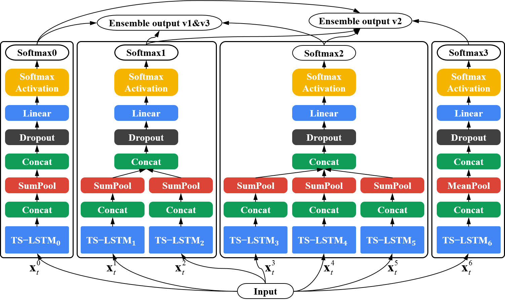

# Ensemble Deep Learning for Skeleton-based Action Recognition using Temporal Sliding LSTM networks

This is a Tensorflow implementation of Ensemble TS-LSTM v1 and v2 models from the paper [Ensemble Deep Learning for Skeleton-based Action Recognition using Temporal Sliding LSTM networks][1] by Inwoong Lee, Doyoung Kim, Seoungyoon Kang, and Sanghoon Lee. You can see the video for the paper in [Naver D2][2] or [Youtube][3] (Korean Language).

## Requirements
- Matlab R2017a
- Python 2.7.12
- Numpy
- [Tensorflow][4]

## Dataset

[1]: http://openaccess.thecvf.com/content_ICCV_2017/papers/Lee_Ensemble_Deep_Learning_ICCV_2017_paper.pdf
[2]: http://m.tv.naver.com/v/2643231
[3]: https://youtu.be/KSy7flzu4Es
[4]: https://www.tensorflow.org/install/
